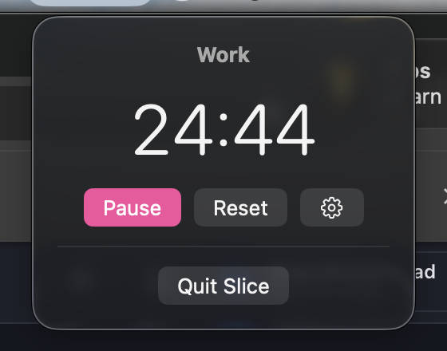
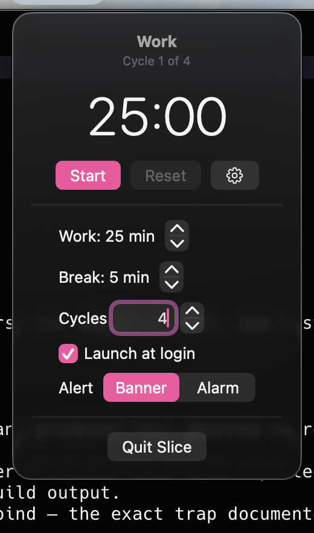

# Slice

Minimal Pomodoro timer for the macOS menu bar. Nothing else.

A ring in the menu bar, a countdown next to it, Start / Pause / Reset in a small panel, a banner and a sound when work or break ends. Work and break lengths are configurable, it can run a set number of cycles back to back, and it can launch at login. No task list, no stats, no sync, no account, no network.

Requires macOS 26.

<p></p>
<p>
  
  
</p>

## Download

Grab `Slice-<version>.zip` from the [latest release](https://github.com/rezaahmadn/Slice/releases/latest), unzip, and move `Slice.app` to `/Applications`.

The app is ad-hoc signed (no Apple Developer account), so the first launch is blocked by Gatekeeper. Either:

1. Try to open it once, then go to **System Settings → Privacy & Security**, scroll down, and click **Open Anyway**; or
2. In Terminal: `xattr -d com.apple.quarantine /Applications/Slice.app`

After that it opens normally.

## Build from source

Requires Xcode 26.

```sh
git clone https://github.com/rezaahmadn/Slice.git
cd Slice
open Slice.xcodeproj   # then press Cmd+R
```

Or from the terminal:

```sh
xcodebuild -project Slice.xcodeproj -scheme Slice -configuration Debug build
```

Builds you make yourself are not quarantined, so they open directly.

## Using it

- Click the ring in the menu bar to open the panel.
- **Start** begins a work session; the same button becomes **Pause**. **Reset** returns to an idle work session.
- Work ends → break starts by itself and an alert says so. Break ends → back to idle; starting the next session is up to you — unless **Cycles** is set, in which case the next work session starts by itself until that many rounds are done, then "All cycles done".
- The gear unfolds settings: work minutes, break minutes, cycles (type any number; 0 = off), launch at login, and the alert style — **Banner** (one notification) or **Alarm** (a floating window and a looping sound until you click Dismiss, instead of the banner).
- Cmd+Q in the panel quits.

## Project layout

- `Slice/` — the app, one type per file: `SliceApp` (entry), `PomodoroTimer` (state machine), `MenuBarView`, `SettingsView`, `Notifications`.
- `SliceTests/` — Swift Testing suites; the timer is driven with synthetic dates so tests never wait.
- `Design/` — SVG icon sources. `Scripts/render-icon.swift` turns them into the PNGs in the asset catalog.
- `project.yml` — [XcodeGen](https://github.com/yonaskolb/XcodeGen) spec. `Slice.xcodeproj` is generated from it and committed, so you only need XcodeGen if you edit `project.yml` (`brew install xcodegen && xcodegen generate`).
- `.github/workflows/release.yml` — on a `v*` tag, builds a Release `Slice.app` on a macOS 26 runner and attaches it as a zip to a GitHub Release.

## Releasing

```sh
git tag v0.3.0
git push origin v0.3.0
```

The version inside the app comes from the tag.

## Roadmap

What's left, and how to pick it up: [TODO.md](TODO.md).

## Non-goals

Slice will not get task lists, statistics, sync, accounts, an iOS app, a Windows/Linux port, or an App Store release. It is one timer in the menu bar.

## License

[MIT](LICENSE)
